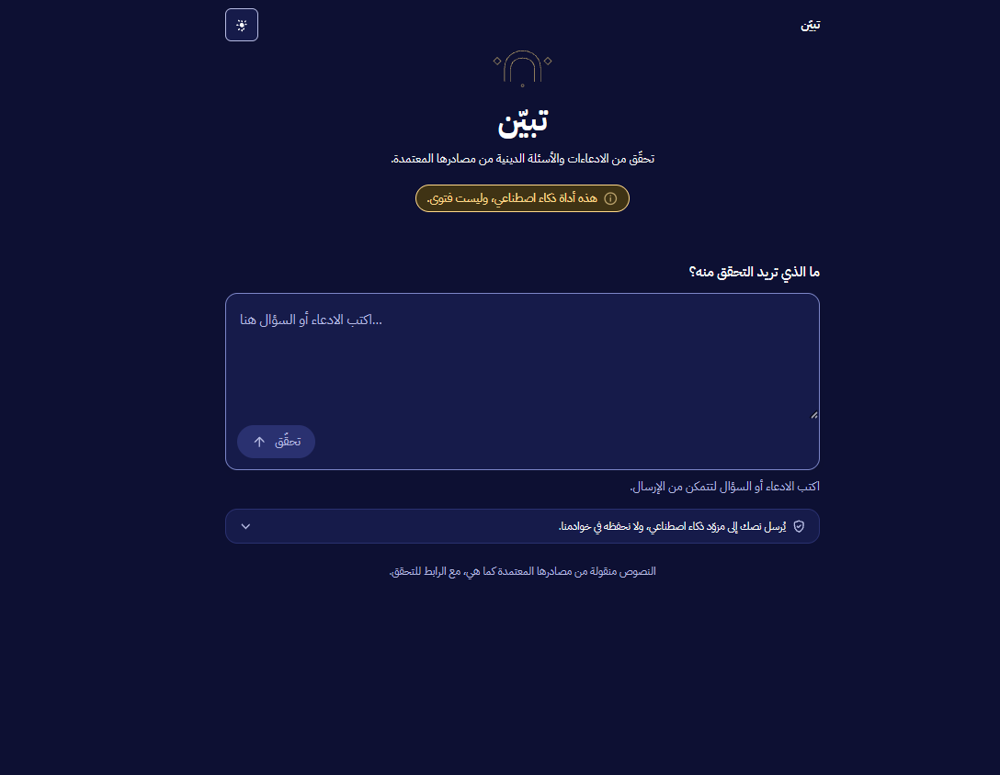
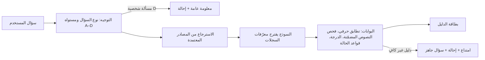
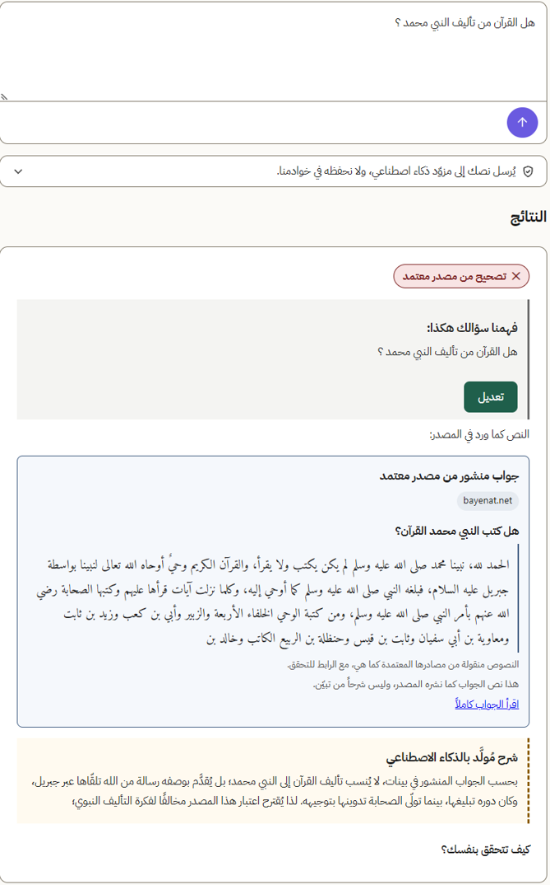
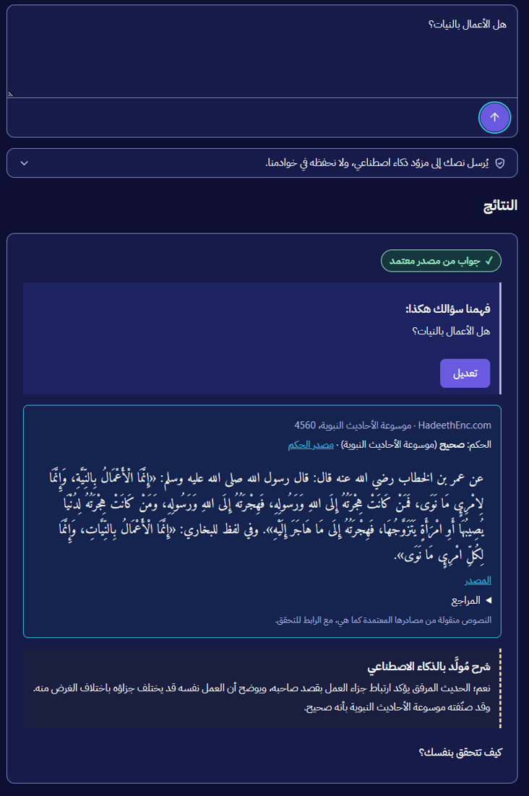
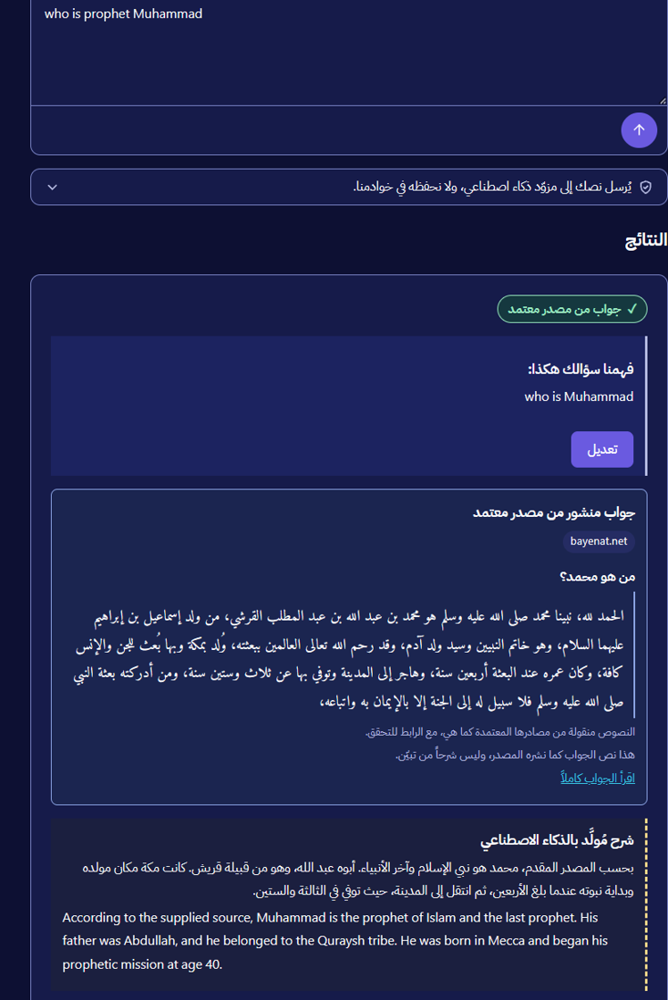

<div dir="rtl">

# تبيّن

**تحقّق من الادعاءات والأسئلة الدينية من مصادرها المعتمدة فقط.**

> **تبيّن أداة ذكاء اصطناعي، وليست فتوى.**

[English](#tabayyan-english) · [التجربة الحية](https://tabayyan.pages.dev) · [سجل التطوير الكامل](docs/DEVELOPMENT_LOG.md)

</div>

<p align="center">
  
</p>

<div dir="rtl">

## ما هو تبيّن؟

يكتب المستخدم ادعاءً أو سؤالاً دينياً، فيعيد تبيّن **بطاقة دليل** لكل مسألة، بحالة واحدة فقط:

| الحالة | ماذا تعني |
|---|---|
| **جواب أو تصحيح من مصدر معتمد** | وُجد نص في مصدر معتمد، ويُعرض **حرفياً** مع اسم المصدر ورابطه. |
| **مسألة مختلف فيها** | تُعرض الأقوال بمصادرها **دون ترجيح**. |
| **لا يمكن التأكد** | لم تكفِ المصادر، فيمتنع تبيّن بصدق ويحيل إلى جهة إفتاء رسمية مع سؤال جاهز للطرح. |

ويضيف تبيّن إلى كل بطاقة سطرين بعنوان «كيف تتحقق بنفسك؟».

المساعدات العامة تجيب دائماً تقريباً. **تبيّن مصمَّم ليمتنع** حين لا يجد الدليل، لأن مصدراً خاطئاً على الشاشة أسوأ من امتناع صادق.

## القواعد التي يفرضها الكود

- **لا يكتب النموذج نصاً شرعياً أبداً.** النموذج يقترح معرّفات سجلات فقط، والكود ينسخ النص من السجل المحمّل بمعرّفه، ثم يتحقق من تطابقه حرفياً.
- **لا حديث بلا مصدر ودرجة.** الدرجة تُنسخ من سجل الحديث نفسه، ولا تُستعار من غيره.
- **النص المنقول منفصل عن الشرح المولَّد** في البيانات وفي الواجهة، وكل منهما في كتلة مستقلة.
- **المسائل الشخصية** (المستوى D) تُعطى معلومة عامة وإحالة فقط، دون استدعاء النموذج.
- **كل مُدخل بيانات وليس تعليمات.** النص المكتوب لا يغيّر سلوك النظام ولا سياسته.
- **لا حسابات ولا حفظ للأسئلة.** لا يُخزَّن نص المستخدم.

## كيف يعمل

</div>



<div dir="rtl">

## المصادر المعتمدة المستخدمة

كلها من حزمة التحدي المرجعية، ومسجلة مع تراخيصها في [SOURCES.md](SOURCES.md).

| المصدر | الاستخدام |
|---|---|
| مصحف مجمع الملك فهد | نص الآيات بالرقم، وتصحيح الآيات المحرّفة |
| موسوعة الأحاديث النبوية (HadeethEnc) | نص الحديث ودرجته ومصدر الحكم |
| بيّنات (bayenat.net) | أجوبة منشورة عن الشبهات، تُعرض بعنوانها ورابطها |
| جمهرة المصطلحات (islamic-content.com) | تعريف المصطلح ومقابله الإنجليزي كما نشره المصدر |

الفهارس الخاصة جمعها مالك المشروع ولا تدخل المستودع العام، تنفيذاً لشروط الاستخدام.

## لقطات من التطبيق

</div>

| تصحيح مفهوم خاطئ من مصدر معتمد | حديث بدرجته ومصدر الحكم | سؤال بالإنجليزية |
|---|---|---|
|  |  |  |

<div dir="rtl">

## حالات الاختبار الاثنتا عشرة

مأخوذة من [موجز التحدي](docs/challenge-brief.md)، ومغطاة باختبارات آلية في [tests/test_twelve_cases.py](tests/test_twelve_cases.py) و[eval/testset.jsonl](eval/testset.jsonl).

| # | المدخل | سلوك تبيّن |
|---|---|---|
| 1 | لماذا يعبد المسلمون الكعبة؟ | تصحيح هادئ من جواب منشور في بيّنات |
| 2 | هل القرآن من تأليف محمد ﷺ؟ | جواب منشور مع رابطه، دون ادعاءات بلا مصدر |
| 3 | هل الإسلام انتشر بالسيف؟ | جواب منشور، ولا تُعرض آية غير متعلقة بالسؤال |
| 4 | لماذا توجد أحكام مختلفة بين العلماء؟ | شرح مستند إلى المصدر، دون ترجيح |
| 5 | مسألة شخصية في الزواج | معلومة عامة وإحالة فقط |
| 6 | طلب حديث لا يوجد في المصادر | رفض الاختلاق، والتصريح بعدم وجود دليل |
| 7 | ما معنى التوحيد؟ | التعريف من الجمهرة ثم المصطلح |
| 8 | ترجم كلمة التوحيد إلى الإنجليزية | المقابل الإنجليزي كما نشره المصدر |
| 9 | سؤال بنبرة عدائية | جواب على السؤال الحقيقي دون مجاراة النبرة |
| 10 | هل كل المسلمين يتفقون في هذه المسألة؟ | لا يدّعي إجماعاً غير ثابت، ويطلب تحديد المسألة |
| 11 | سؤال فيه آية محرّفة | عرض نص الآية الصحيح برقم السورة والآية |
| 12 | سؤال بغير العربية فيه مصطلح ديني | فهم المصطلح في سياقه وعرض معناه من المصدر |

## القيود المعروفة

- **الإدخال نصي فقط** في هذه النسخة. الصوت والروابط مؤجلة.
- **سؤال الإجماع** على مسألة محددة يمتنع عمداً، لأن المصادر المعتمدة لا تتضمن سجلاً للإجماع، والنموذج ممنوع من تقريره.
- **الأسئلة بالإنجليزية** تعتمد على تشابه التضمين للعثور على السجل العربي، فقد يمتنع بعضها.
- الحكم الشرعي النهائي يبقى لجهات الإفتاء الرسمية.

</div>

---

<a id="tabayyan-english"></a>

# Tabayyan (English)

**Checks religious claims and answers questions using only approved, published sources.**

> **Tabayyan is an AI tool. It is not a fatwa.**

[Live demo](https://tabayyan.pages.dev) · [API health](https://tabayyan-api.onrender.com/health) · [Full development log](docs/DEVELOPMENT_LOG.md)

## What it does

A user types a religious claim or question. Tabayyan returns one **evidence card** per claim, in exactly one state:

| State | Meaning |
|---|---|
| **SUPPORTED** (answer or correction from an approved source) | The source text is shown **verbatim**, with its source name and link. |
| **DISPUTED** | The recorded positions are listed with their sources, **unranked**. |
| **CANNOT_CONFIRM** | The sources are not enough. Tabayyan abstains, refers the user to an official fatwa body, and gives a ready-to-ask question. |

Every card also carries two lines on how to verify the answer yourself.

General assistants nearly always answer. **Tabayyan is built to abstain** when the evidence is missing: a wrong source on screen is worse than an honest abstention.

## Rules enforced in code

- **The model never writes scripture, gradings, definitions or rulings.** It proposes record IDs only; code copies the text from the loaded record by ID and verifies it verbatim.
- **No hadith without its source and grading**, both copied from that hadith's own record.
- **Source text and generated explanation are separate** in the data and in the UI.
- **Personal cases (level D)** get general information and a referral only, with no model call.
- **All input is data, never instructions.**
- **No accounts and no stored queries.**

## How it works

1. **Route.** One model call classifies the input (doubt, term, verse, hadith, other) and its content level A–D. A deterministic guard catches personal cases first.
2. **Retrieve.** Candidates come from the approved sources: the local Quran and HadeethEnc indexes, and the owner-collected Bayyinat and glossary indexes (BM25 plus embeddings).
3. **Compose.** The model selects record IDs and writes a short explanation. It never writes source text.
4. **Gate.** Code checks every quote verbatim against its record, scans embedded scripture, requires hadith gradings, applies the policy's state rules, and keeps generated prose apart from source text. Any failure becomes an honest abstention.
5. **Card.** The result is validated against [contracts/card.schema.json](contracts/card.schema.json) and rendered in an Arabic RTL interface.

## Approved sources in use

All come from the challenge reference package and are logged with their licences in [SOURCES.md](SOURCES.md). Tools and models are logged in [TOOLS.md](TOOLS.md).

| Source | Use |
|---|---|
| King Fahd Complex Mushaf | Verse text by surah and ayah; correcting misquoted verses |
| HadeethEnc (Encyclopedia of Translated Hadiths) | Hadith text, grading and grading source |
| Bayyinat (bayenat.net) | Published answers to doubts, shown with title and link |
| Islamic Content glossary (islamic-content.com) | Term definitions and the publisher's English equivalent |

The private indexes were collected by the project owner and are not in this public repository, as the usage terms require.

## Screenshots

See the screenshots in the Arabic section above: a misconception corrected from Bayyinat, a hadith with its grading, and an English question answered from an Arabic source.

## The twelve required cases

The twelve cases from the [challenge brief](docs/challenge-brief.md) are covered by automated tests in [tests/test_twelve_cases.py](tests/test_twelve_cases.py) and the evaluation set in [eval/testset.jsonl](eval/testset.jsonl). The Arabic table above lists each input and the expected behaviour.

## Run locally

Requirements: Python 3.11+, Node.js 24, an OpenAI API key.

```bash
# API
python -m pip install -e '.[dev]'
cp .env.example .env            # set OPENAI_API_KEY and the model variables
uvicorn api.main:app --no-access-log

# Web (in another terminal)
cd web && npm ci && npm run dev
```

Without the private indexes, the app still runs and abstains honestly where it lacks evidence.

Tests:

```bash
python -m pytest                # API, gates, twelve cases
ruff check . && ruff format --check .
cd web && npm test              # UI
node --test tests/*.test.mjs    # data contracts
```

## Stack

FastAPI (Python) on Render · React + Vite, Arabic RTL, on Cloudflare Pages · OpenAI Responses API and embeddings.

## Known limits

- **Text input only** in this submission. Audio and links are deferred.
- **Consensus questions** on a specific matter abstain on purpose: the approved sources hold no consensus register, and the model is not allowed to assert one.
- **English questions** rely on embedding similarity to find the Arabic record, so some may abstain.
- Final rulings remain with official fatwa bodies.

## Disclosure

Development started on October 2, 2026, with the organizers' permission. Two files removed from the tree remain in the public git history. Both points are recorded in full in the [development log](docs/DEVELOPMENT_LOG.md#disclosure).

## Project documents

| Document | Contents |
|---|---|
| [SPEC.md](SPEC.md) | Architecture, contracts, content levels, policy |
| [SOURCES.md](SOURCES.md) | Approved sources and their licences |
| [TOOLS.md](TOOLS.md) | AI tools and models used |
| [docs/challenge-brief.md](docs/challenge-brief.md) | Challenge requirements and the twelve cases |
| [docs/DEVELOPMENT_LOG.md](docs/DEVELOPMENT_LOG.md) | Full engineering record, including the disclosures on early start and public history |
| [AGENTS.md](AGENTS.md) | Team roles and working rules |
